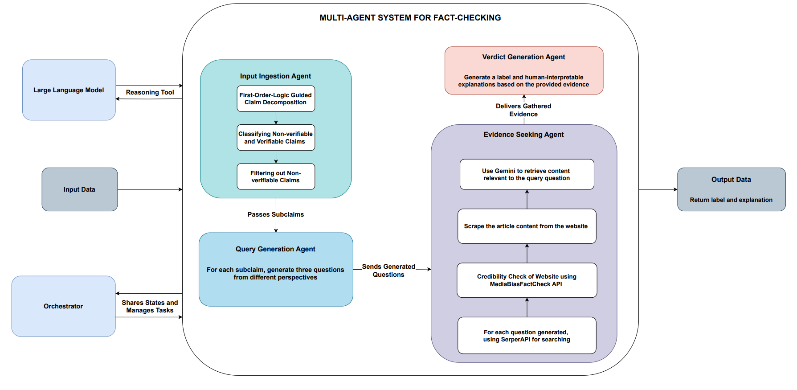

# TruthMesh — AI-Powered Fact-Checking Platform

A production-deployed, multi-agent fact-checking system that verifies text claims (and optionally images) against live web evidence.  Built with a three-stage LangGraph pipeline, FastAPI backend, React/Vite frontend, JWT authentication, and PostgreSQL persistence.



**Live Demo:** [truthmesh-ai.vercel.app](https://truthmesh-ai.vercel.app)  
**Backend API:** [truthmesh-api.onrender.com](https://truthmesh-api.onrender.com)  
**GitHub:** [ashhal-kaleem/TruthMesh](https://github.com/ashhal-kaleem/TruthMesh)

**Author:** Ashhal Kaleem

---

## Production Architecture

```
Vercel (React/Vite)
    │  HTTPS multipart/JSON
    ▼
Render (FastAPI · uvicorn)
    │  SQLAlchemy ORM
    ├──▶ Supabase PostgreSQL  ─ users / claim records / evidence citations
    │       pgvector extension ─ RAG similarity search
    │  Google Generative AI SDK
    └──▶ Gemini gemini-3.6-flash ─ plan + verdict (2 LLM calls per claim)
              │
              └──▶ Groq fallback (openai/gpt-oss-120b, text-only, quota errors only)
```

Evidence is retrieved via **Serper** (Google Search JSON API) + BeautifulSoup.  No Selenium or browser automation — compatible with Render's free tier.

---

## Features

| Feature | Detail |
|---|---|
| **Text claim verification** | Paste any factual assertion; receive a `SUPPORT / REFUTE / UNCERTAIN` verdict with confidence score |
| **Image upload** | Optionally attach an image (≤ 5 MB); Gemini analyses visual context alongside the text claim |
| **Multi-source evidence** | Serper retrieves multiple independent articles per subclaim |
| **Credibility scoring** | Each source is labelled High / Medium / Low and given a bias label |
| **JWT authentication** | Register / login; all claims for authenticated users are persisted |
| **Persistent history** | Paginated `/me/history` — browse past verifications with full citations |
| **RAG context** | pgvector similarity search surfaces related past claims before each new verification |
| **Groq fallback** | Text-only calls fall back to Groq automatically on Gemini quota errors |
| **Settings / API health** | Live ping to backend with latency display; configurable via env vars |
| **Responsive UI** | Mobile-first sidebar layout with dark-capable CSS variable design system |

---

## Pipeline

Each `/check_claim` request runs exactly **2 LLM calls**:

```
POST /check_claim (claim text + optional image)
        │
        ▼
[plan_node — LLM call #1]
  Gemini decomposes the claim into verifiable subclaims
  and generates 2–3 search queries per subclaim.
  Image content (if present) included in this call.
        │
        ▼
[evidence_node — 0 LLM calls]
  Serper + BeautifulSoup retrieve articles for every query.
  Pure Python — deterministic, no LLM involvement.
        │
        ▼
[verdict_node — LLM call #2]
  Gemini synthesises all evidence into:
    label:       SUPPORT | REFUTE | UNCERTAIN
    explanation: structured reasoning (markdown)
        │
        ▼
  Confidence computed from source credibility scores.
  Result persisted to PostgreSQL. RAG write-back for future queries.
```

---

## Image Pipeline & Security

Images are accepted as multipart form uploads on `POST /check_claim`.

**Validation (server-side, `src/api.py`):**
1. **Size limit** — rejected with HTTP 413 if the file exceeds **5 MB**.
2. **Magic-byte MIME validation** — the `filetype` library inspects actual file bytes (not the `Content-Type` header). Non-image bytes are rejected with HTTP 415.
3. **Base64 encode** — valid images are encoded as a `data:<mime>;base64,…` URI and passed directly to Gemini.

Gemini's vision capability is used for both the plan (subclaim decomposition) and verdict nodes.  Image-bearing calls **never** fall back to Groq because Groq has no vision API.

---

## API Reference

Base URL (production): `https://truthmesh-api.onrender.com`

| Method | Path | Auth | Description |
|---|---|---|---|
| `GET` | `/` | — | Health check; returns `{ status, message, version }` |
| `POST` | `/auth/register` | — | Register; returns JWT |
| `POST` | `/auth/login` | — | Login; returns JWT |
| `POST` | `/check_claim` | optional | Verify a claim (text + optional image); returns `FactCheckResponse` |
| `GET` | `/me/history` | required | Paginated claim history (`?page=1&page_size=10`) |
| `GET` | `/me/history/{claim_id}` | required | Single history record by ID |

### `POST /check_claim` — form fields

| Field | Type | Required | Notes |
|---|---|---|---|
| `claim` | `string` (form) | ✓ | The text claim to verify |
| `image` | `File` (multipart) | ✗ | JPEG / PNG / WEBP / GIF · max 5 MB |

`Authorization: Bearer <token>` header is optional; omitting it stores the result anonymously.

### `FactCheckResponse` schema

```json
{
  "claim":            "string",
  "verdict":          "SUPPORT | REFUTE | UNCERTAIN",
  "confidence":       0.0,
  "reasoning":        "string (markdown)",
  "evidence_citations": [
    {
      "url":               "string",
      "title":             "string",
      "excerpt":           "string",
      "credibility_score": "High | Medium | Low | Unknown",
      "bias_label":        "string"
    }
  ],
  "image_analyzed":     false,
  "past_context_used":  false
}
```

---

## Project Structure

```
TruthMesh/
├── src/
│   ├── api.py              # FastAPI app — all endpoints, CORS, lifespan
│   ├── auth.py             # JWT helpers (bcrypt + python-jose)
│   ├── database.py         # SQLAlchemy ORM: users / claim_records / evidence_citations
│   ├── main_agent.py       # LangGraph pipeline: plan → evidence → verdict
│   ├── vector_store.py     # Pluggable RAG: InMemory (dev) or pgvector (prod)
│   ├── evaluate.py         # Offline benchmark evaluation utilities
│   ├── utils.py            # Shared helpers
│   ├── prompts/            # Pydantic-typed prompt templates
│   │   ├── input_ingestion.py      # Plan / subclaim decomposition schema
│   │   ├── evidence_seeking.py     # Evidence structure schema
│   │   └── verdict_prediction.py  # VerdictPrediction schema
│   ├── tools/
│   │   ├── retrieve.py             # Serper + BeautifulSoup retrieval tool
│   │   └── media_bias_data.json    # Source bias reference data
│   └── experiments/        # Research baselines (CoT / Direct / SASE / Folk)
├── frontend/
│   ├── src/
│   │   ├── api.js          # All fetch calls + verdict normalisation layer
│   │   ├── auth.js         # localStorage token helpers
│   │   ├── App.jsx         # Router + ProtectedRoute guard
│   │   ├── context/        # AuthContext (React context + provider)
│   │   ├── components/     # Layout (sidebar), FactCard, …
│   │   └── pages/          # Home, Analysis, History, Settings, Login
│   ├── package.json        # React 18 + Vite 6 + Tailwind v4 + react-router-dom v7
│   └── vite.config.js
├── tests/
│   ├── conftest.py         # Sets SQLite + FakeEmbeddings env before imports
│   ├── test_api.py         # Full mocked test suite (24 tests)
│   ├── test_fallback.py    # Fallback & quota error routing (10 tests)
│   ├── test_mock_pipeline.py
│   └── test_real_claim.py
├── data/                   # Benchmark datasets (FeverousDev, HoVerDev, SciFact-Open)
├── requirements.txt
├── render.yaml             # Render deployment config
└── .env.example
```

---

## Local Development

### Prerequisites

- Python 3.11+
- Node.js 18+

### Backend setup

```bash
git clone https://github.com/ashhal-kaleem/TruthMesh.git
cd TruthMesh

python3.11 -m venv venv
# Windows:
venv\Scripts\activate
# macOS / Linux:
source venv/bin/activate

pip install -r requirements.txt

cp .env.example .env
# Edit .env — at minimum set GOOGLE_API_KEY and SERPER_API_KEY
```

Start the API server:

```bash
uvicorn src.api:app --reload
# Available at http://localhost:8000
# Interactive docs: http://localhost:8000/docs
```

### Frontend setup

```bash
cd frontend
npm install
```

Create `frontend/.env`:

```env
VITE_API_BASE=http://localhost:8000
VITE_MOCK_MODE=false
```

Start the dev server:

```bash
npm run dev
# Available at http://localhost:5173
```

### Environment variables

| Variable | Required | Description |
|---|---|---|
| `GOOGLE_API_KEY` | ✓ | Gemini LLM + embeddings (gemini-embedding-2) |
| `SERPER_API_KEY` | ✓ | Google Search via Serper |
| `DATABASE_URL` | — | PostgreSQL URL (production) or SQLite path (default: `sqlite:///./truthmesh.db`) |
| `JWT_SECRET_KEY` | ✓ (prod) | 64-char random string for JWT signing |
| `JWT_ALGORITHM` | — | Default `HS256` |
| `JWT_EXPIRE_DAYS` | — | Default `7` |
| `VECTOR_BACKEND` | — | `fake` (dev/test, default) or `pgvector` (production) |
| `GROQ_API_KEY` | — | Optional Groq fallback for text-only quota errors |
| `CORS_ORIGINS` | — | Comma-separated allowed origins, or `*` |
| `ENVIRONMENT` | — | `development` / `production` / `test` |

**Frontend:**

| Variable | Default | Description |
|---|---|---|
| `VITE_API_BASE` | `http://localhost:8000` | Backend URL |
| `VITE_MOCK_MODE` | `false` | Set `true` to use hardcoded mock responses (no backend required) |

---

## Testing

The test suite mocks all external calls (Gemini, Serper) and uses SQLite + `FakeEmbeddings`.  No API keys or live services are required.

```bash
pytest tests/ -v
```

**`tests/test_api.py` covers:**
- `GET /` health check and version
- `POST /check_claim` — text-only, with image, anonymous, authenticated
- All three verdict classes (`SUPPORT`, `REFUTE`, `UNCERTAIN`) — parametrised
- Confidence bounded `[0.0, 1.0]`; `UNCERTAIN` capped `≤ 0.55`
- Citation URL deduplication
- `POST /auth/register` — success, duplicate username, duplicate email, short password (422)
- `POST /auth/login` — success, wrong password, non-existent user
- `GET /me/history` — requires auth, pagination
- `GET /me/history/{claim_id}` — success, 404, cross-user isolation (returns 404)
- HTTP 401 for missing / invalid tokens
- HTTP 422 on missing required form field
- CORS preflight headers
- 404 on unknown routes

---

## Deployment

### Backend — Render

`render.yaml` is included.  Key settings:

```yaml
startCommand: uvicorn src.api:app --host 0.0.0.0 --port $PORT
```

Required Render environment variables: `DATABASE_URL`, `GOOGLE_API_KEY`, `SERPER_API_KEY`, `JWT_SECRET_KEY`.  `JWT_SECRET_KEY` can be auto-generated by Render (`generateValue: true`).

**Supabase note:** Set `DATABASE_URL` to the **transaction pooler** URL (port `6543`), not the direct connection (port `5432`). The direct port resolves to IPv6 on Render and fails with "Network is unreachable". `database.py` and `vector_store.py` both apply an automatic port swap if the URL still contains `:5432`.

### Frontend — Vercel

Deploy the `frontend/` directory.  Set the following environment variable in the Vercel dashboard:

```
VITE_API_BASE=https://truthmesh-api.onrender.com
```

Build command: `npm run build`  
Output directory: `dist`

---

## Known Limitations

- **Gemini free-tier quota** — The free Gemini API quota is modest. On heavy usage, calls may be throttled (`ResourceExhausted` / 429). The Groq fallback (`GROQ_API_KEY`) mitigates this for text-only claims. Image-bearing claims always require Gemini (Groq has no vision API) and will surface a 503 if the quota is exhausted.
- **Render cold starts** — The free Render tier spins down after inactivity. First requests after idle may take 30–60 s to respond. The frontend shows a "taking longer than expected" notice after 30 s.
- **Render egress** — Render free instances have limited outbound bandwidth; prolonged scraping-heavy sessions may hit rate limits.
- **SQLite in dev** — The default `DATABASE_URL` writes to `truthmesh.db` (local SQLite). This is fine for development but must be replaced with a PostgreSQL URL before production deployment.
- **Diagnostic log line** — `database.py` emits a `[DB DIAG]` startup log line. This is intentional for Render log verification and can be removed once connection stability is confirmed.

---

## Tech Stack

**Backend:** Python 3.11 · FastAPI · LangGraph · LangChain · `google-genai` / `langchain-google-genai` · `langchain-groq` · SQLAlchemy · `psycopg` (v3) · `python-jose` · `passlib[bcrypt]` · `filetype` · BeautifulSoup4 · Serper

**Frontend:** React 18 · Vite 6 · Tailwind CSS v4 · `react-router-dom` v7 · `lucide-react`

**Infrastructure:** Vercel (frontend) · Render (API) · Supabase PostgreSQL + pgvector (database + RAG)
